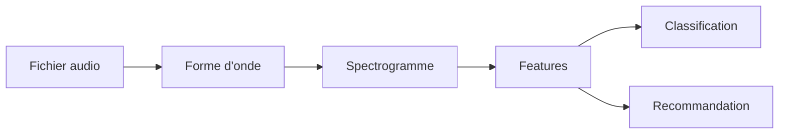
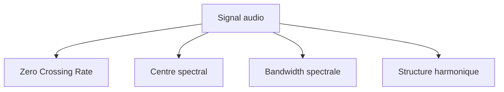

# Jour 1

## Comprendre la structure musicale et les signaux audio (3H30)

**Notions clés**
- **Signal audio** : suite de valeurs qui représente le son dans le temps.
- **Fréquence d'échantillonnage** : nombre de mesures du signal par seconde.
- **Forme d'onde** : représentation de l'amplitude au cours du temps.
- **Spectrogramme** : représentation temps-fréquence de l'énergie sonore.
- **Librosa** : bibliothèque Python qui aide à lire, afficher et analyser un signal audio.
- **Feature** : caractère numérique extrait du signal pour décrire le son de façon compacte.
- **Feature engineering** : choix et calcul des features utiles pour la suite du projet.

**Ce que ce chapitre couvre exactement**
- les notions de théorie musicale de base : notes, gammes, accords, rythmes, tempo, mesures ;
- les composants temporels et fréquentiels d'un signal sonore : fréquence d'échantillonnage, amplitude, durée ;
- la visualisation d'un extrait musical dans le temps et dans les fréquences ;
- la lecture de la forme d'onde ;
- l'extraction de features fréquentiels et harmoniques ;
- l'analyse des spectrogrammes ;
- la comparaison des profils sonores de différents genres musicaux.

**Introduction**
Cette première partie pose les bases de la musique et du signal audio pour comprendre ce que l'on manipule ensuite en traitement audio.
L'objectif est de passer d'une écoute intuitive à une lecture technique du son.
Avant de faire des calculs, il faut savoir reconnaître ce que représente un son, comment il est structuré, et pourquoi deux morceaux peuvent être comparés numériquement.

**Explication**
On relie les notions musicales simples à leur traduction dans un signal numérique : hauteur, rythme, fréquence, amplitude et durée.
Une guitare, par exemple, permet d'illustrer concrètement la différence entre une note jouée, sa fréquence fondamentale et sa forme d'onde enregistrée.
Dans le cours, Librosa est l'outil de référence pour visualiser ces signaux ; ici, le code utilise SciPy pour rester exécutable dans le dépôt.

**Pourquoi commencer par là ?**
Avant d'apprendre des formules ou des algorithmes, il faut savoir ce qu'est un signal audio, comment il est représenté et pourquoi on peut le transformer en nombres.

**Les notions musicales en pratique**
- **Notes** : hauteurs sonores distinctes.
- **Gammes** : ensembles de notes organisées selon une logique musicale.
- **Accords** : plusieurs notes jouées ensemble.
- **Rythmes** : organisation des durées dans le temps.
- **Tempo** : vitesse globale du morceau.
- **Mesures** : découpage du temps musical en unités régulières.

**Schéma conceptuel**



Ce schéma montre le trajet général du cours. On part du fichier audio, on l'observe, on extrait des mesures, puis on les utilise pour la classification ou la recommandation.

**Contexte**
En analyse musicale, il faut savoir lire un extrait sonore avant de pouvoir en extraire des caractéristiques exploitables.
C'est la base pour préparer des données audio avant toute classification ou recommandation.
Le lab associé à ce chapitre utilise le fichier `labs/lab-01/assets/Games.wav`.
Dans ce chapitre, on voit aussi comment un son se décrit à la fois dans le temps et dans les fréquences.

**Tracer la forme d'onde**
La forme d'onde est la première lecture du signal. Elle permet de voir les variations d'amplitude et les grandes structures temporelles avant de passer au spectrogramme.
Si la forme d'onde est très dense ou très irrégulière, cela donne déjà une première idée du comportement du son.
Elle sert à répondre à une question simple : quand le son est-il fort, quand est-il faible, et comment évolue-t-il dans le temps ?

**Formule mathematique**

$$
f_s = \frac{N}{T}
$$

**Lecture de la formule**
"f indice s égale N sur T."

**Sens de la formule**
La fréquence d'échantillonnage relie le nombre d'échantillons à la durée observée.

**Lien avec la théorie**
Plus la fréquence d'échantillonnage est élevée, plus le signal est détaillé dans le temps.

**Décomposition mathématique**
- `f_s` : fréquence d'échantillonnage en hertz
- `N` : nombre total d'échantillons
- `T` : durée du signal en secondes

**Résultat attendu**
Savoir faire le lien entre notions musicales et représentation numérique d'un son.
Savoir expliquer ce que représente un signal audio et pourquoi sa structure temporelle et fréquentielle compte.
Savoir expliquer à quoi sert Librosa dans un cours d'audio.

**Code**

Script correspondant : `labs/lab-01/scripts/02_waveform_and_spectrogram.py`

```python
# Import des bibliothèques pour le calcul numérique et l'affichage.
import numpy as np
# Signal permet de calculer le spectrogramme.
from scipy import signal
# Lecture du fichier audio au format WAV.
from scipy.io import wavfile
# Matplotlib sert à tracer la forme d'onde et le spectrogramme.
import matplotlib.pyplot as plt

# Chargement du fichier audio du lab.
sr, y = wavfile.read("labs/lab-01/assets/Games.wav")

# Conversion en mono si le fichier est stéréo.
if y.ndim == 2:
    y = y.mean(axis=1)

# Conversion en flottants entre -1 et 1.
y = y.astype(float) / 32768.0

# Conservation d'un extrait court pour garder des figures lisibles.
max_seconds = 20
y = y[: min(len(y), int(sr * max_seconds))]

# Durée du signal en secondes.
duration = len(y) / sr
# Axe temporel associé à chaque échantillon.
t = np.linspace(0, duration, len(y), endpoint=False)

# Affichage des infos de base.
print("Fréquence d'échantillonnage:", sr)
print("Durée (s):", duration)

# Trace de la forme d'onde.
plt.figure(figsize=(10, 3))
plt.plot(t, y)
plt.title("Forme d'onde")
plt.xlabel("Temps (s)")
plt.ylabel("Amplitude")
plt.show()

# Calcul et affichage du spectrogramme.
plt.figure(figsize=(10, 3))
f, tt, Zxx = signal.stft(y, fs=sr, nperseg=1024)
plt.pcolormesh(tt, f, np.abs(Zxx), shading='gouraud')
plt.colorbar(label='Amplitude')
plt.title("Spectrogramme")
plt.xlabel("Temps (s)")
plt.ylabel("Fréquence (Hz)")
plt.show()
```

**Explication du code**
Ce bloc charge un extrait audio, affiche sa forme d'onde, puis calcule un spectrogramme pour visualiser l'information temps-frequence. L'objectif est de relier la notion de signal audio brut à une lecture plus technique du son.
Le résultat attendu est de voir d'abord la courbe dans le temps, puis l'image du spectrogramme. La courbe montre l'amplitude, et le spectrogramme montre où se trouve l'énergie selon les fréquences.
Le script du lab enregistre aussi ces figures dans `labs/lab-01/outputs/`.

## Extraire les caractéristiques audio (3h30)

**Introduction**
Cette partie montre comment transformer un signal audio en descripteurs numériques utilisables pour l'analyse et la classification.
On cherche ici à représenter un morceau par quelques mesures robustes plutôt que par l'onde brute.

**Explication**
On extrait des mesures simples comme le zero crossing rate ou le centre spectral pour décrire le contenu sonore.
Ces descripteurs résument l'énergie, la brillance ou l'activité du signal sous une forme compacte.
Le **zero crossing rate** compte combien de fois le signal change de signe entre deux échantillons consécutifs.
Le **centre spectral** indique à quelle fréquence l'énergie du signal est principalement concentrée.

**À retenir simplement**
- Le **ZCR** parle de l'agitation du signal.
- Le **centre spectral** parle de la position de l'énergie dans les fréquences.
- Ces deux mesures donnent une première description numérique du son.

**Structure harmonique**
La structure harmonique décrit les fréquences liées à une note fondamentale et aux harmoniques qui l'accompagnent. C'est ce qui donne au son sa couleur ou son timbre.

**Pourquoi ces features ?**
Les features réduisent un signal complexe à quelques variables interprétables. Elles rendent possible la comparaison entre morceaux et l'entraînement d'un modèle.

**Utiliser Librosa pour extraire des features fréquentiels et harmoniques**
La logique de ce chapitre consiste à résumer le signal avec des descripteurs comme le zero crossing rate, le centroid spectral, la bandwidth et la structure harmonique.
Librosa est souvent utilisé pour faire ce travail automatiquement sur de vrais fichiers audio.
Cette bibliothèque est importante parce qu'elle évite d'écrire tout le traitement audio à la main, tout en donnant accès à des mesures standard du domaine musical.

**Schéma des features**



Ce schéma aide à comprendre que plusieurs mesures différentes décrivent un même morceau sous des angles différents.

**Contexte**
Ces caractéristiques servent à comparer des morceaux ou à préparer un dataset pour un modèle de machine learning.
Dans un système musical, elles peuvent aider à distinguer des genres, des instruments ou des ambiances.

**Comparer les profils sonores de différents genres musicaux**
En observant les features et les spectrogrammes de plusieurs morceaux, on peut repérer des signatures sonores différentes selon les genres. Cette comparaison prépare directement le terrain pour la classification.
Par exemple, un morceau très percussif n'aura pas la même signature qu'un morceau très mélodique ou très harmonique.
L'idée est de voir qu'un genre n'est pas seulement un nom : c'est aussi une certaine organisation du son dans le temps et dans les fréquences.

**Éléments techniques importants**
- **ZCR** : donne une idée de l'agitation du signal.
- **Centre spectral / centroid spectral** : mesure où se concentre l'énergie dans les fréquences.
- **Bandwidth spectrale** : mesure l'étendue de cette énergie.
- **Structure harmonique** : décrit les fréquences liées à la fondamentale et à ses harmoniques.
- **STFT** : découpe le signal en petites fenêtres pour observer son évolution dans le temps.
- **FFT** : transforme le signal du temps vers les fréquences.

**Analyser les spectrogrammes**
Le spectrogramme aide à voir comment les harmoniques évoluent dans le temps et à comparer plus facilement deux genres musicaux.
Il permet de voir si certaines zones de fréquences sont stables, très actives ou fortement concentrées à des moments précis.

**Formule mathematique**

$$
ZCR = \frac{1}{N-1} \sum_{n=1}^{N-1} \mathbf{1}(x_n x_{n-1} < 0)
$$

**Lecture de la formule**
"Z C R égale un sur N moins 1 fois la somme de l'indicatrice de x n fois x n moins 1 inférieur à zéro."

**Sens de la formule**
Le zero crossing rate mesure combien de fois le signal change de signe.

**Lien avec la théorie**
Un ZCR élevé correspond souvent à un signal plus agité ou plus bruité, tandis qu'un ZCR faible correspond à un signal plus stable.

**Interprétation audio**
Un son percussif ou bruité tend à avoir un ZCR plus fort qu'un son pur et stable comme une note tenue.

**Décomposition mathématique**
- `N` : nombre total d'échantillons pris en compte
- `x_n` : valeur de l'échantillon numéro `n`
- `1[x_n x_{n-1} < 0]` : vaut `1` si le signal change de signe entre deux échantillons consécutifs, sinon `0`

**Résultat attendu**
Savoir extraire et interpréter des features audio de base.
Savoir expliquer à quoi servent ces features dans une chaîne d'analyse musicale.
Savoir relier les nombres calculés à ce qu'on entend dans le morceau.

**Code**

Script correspondant : `labs/lab-01/scripts/03_audio_features.py`

```python
# Import des outils de calcul numérique.
import numpy as np
# Chargement du fichier audio de reference.
from scipy.signal import find_peaks
from scipy.io import wavfile

# Lecture de l'extrait audio.
sr, y = wavfile.read("labs/lab-01/assets/Games.wav")

# Conversion en mono si le fichier est stéréo.
if y.ndim == 2:
    y = y.mean(axis=1)

# Normalisation du signal pour travailler en flottants.
y = y.astype(float) / 32768.0

# Conservation d'un extrait court pour accélérer les calculs.
max_seconds = 20
y = y[: min(len(y), int(sr * max_seconds))]

# Zero crossing rate : nombre de changements de signe.
zcr = np.mean(np.abs(np.diff(np.sign(y))) > 0)

# Transformation vers le domaine fréquentiel.
freqs = np.fft.rfftfreq(len(y), d=1 / sr)
spec = np.abs(np.fft.rfft(y))
spec_sum = spec.sum()
# Centroid spectral : fréquence moyenne pondérée par l'énergie.
centroid = (freqs * spec).sum() / spec_sum
# Largeur spectrale autour du centroid.
bandwidth = np.sqrt(((freqs - centroid) ** 2 * spec).sum() / spec_sum)

# Quelques pics du spectre pour illustrer la structure harmonique.
peaks, _ = find_peaks(spec, distance=50)
top_peaks = peaks[np.argsort(spec[peaks])[-5:]]
dominant_freqs = sorted(freqs[top_peaks])

# Affichage des descripteurs calcules.
print("ZCR:", zcr)
print("Spectral centroid:", centroid)
print("Spectral bandwidth:", bandwidth)
print("Dominant frequencies:", [round(freq, 2) for freq in dominant_freqs])
```

**Explication du code**
Ce bloc transforme le signal audio en mesures compactes. Le ZCR donne une idée de l'agitation du signal, tandis que le centroid et la bandwidth décrivent la répartition de l'énergie dans les fréquences.
L'extraction de quelques fréquences dominantes donne aussi une première lecture très simple de la structure harmonique du son.

**Interprétation du résultat**
- `ZCR` donne une idée de l'agitation du signal.
- `Centroid` indique si l'énergie est plutôt grave ou aiguë.
- `Bandwidth` indique si l'énergie est concentrée ou étalée.
- Ces valeurs servent ensuite à comparer deux sons ou à nourrir un modèle.

## Synthèse du jour

- Lire un signal audio comme un objet numérique.
- Relier notions musicales et représentation temps-fréquence.
- Extraire des features simples à partir d'un fichier audio de référence.
