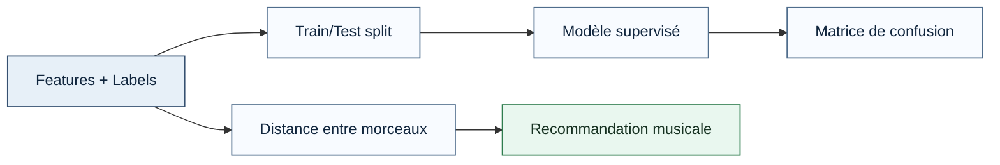
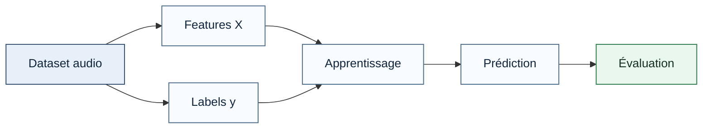
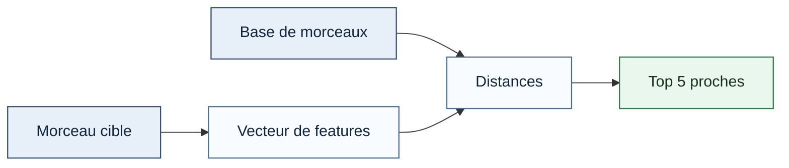

# Jour 2

**Notions clés**
- **Jeu de données** : collection de morceaux décrits par des features audio.
- **Features** : variables numériques qui résument le son.
- **Labels** : genres ou classes associées aux morceaux.
- **Train/Test split** : séparation des données pour apprendre puis évaluer.
- **Classifieur** : modèle qui prédit une classe à partir de features.
- **Matrice de confusion** : tableau qui compare les classes réelles et prédites.
- **Similarité** : proximité entre deux morceaux dans l'espace des features.

**Schéma général du jour**



Ce schéma montre les deux blocs du jour 2 : la classification supervisée et la recommandation par similarité.

**Lire le schéma général (bloc par bloc)**
- `Features` : colonnes numériques qui décrivent chaque morceau (ex: `zcr`, `centroid_hz`, `bandwidth_hz`, `rms`).
- `Labels` : classe cible à prédire (ex: `classical`, `rock`, `electronic`).
- `Train/Test split` : séparation des données en deux parties, une pour apprendre, une pour vérifier.
- `Modèle supervisé` : algorithme qui apprend la relation `X -> y`.
- `Matrice de confusion` : tableau qui montre les bonnes prédictions (diagonale) et les erreurs (hors diagonale).
- `Distance entre morceaux` : mesure numérique de proximité entre deux vecteurs de features.
- `Recommandation musicale` : sélection des morceaux avec les plus petites distances.


**Lab associe**
- `labs/lab-02/README.md`

**Vocabulaire minimal à retenir**
- `Sample` : une ligne du dataset, donc un morceau (ou un extrait).
- `Feature vector` : toutes les features d'un sample, regroupées en un seul vecteur.
- `X` : matrice des features, utilisée comme entrée du modèle.
- `y` : vecteur des labels, utilisé comme cible.
- `Target` : morceau de référence pour lequel on cherche des voisins.
- `Top-k` : les `k` meilleurs résultats triés selon un score (ici la distance).

## Appliquer le machine learning à la classification de genres (3h30)

**Introduction**
Cette partie montre comment utiliser les features audio pour entraîner un modèle de classification.
L'objectif est de passer d'un tableau de descripteurs à une prédiction de genre exploitable.

**Explication**
L'idée est de représenter chaque morceau par un vecteur de caractéristiques, puis d'apprendre à associer ce vecteur à un genre.
En pratique, chaque ligne du dataset devient un morceau, et chaque colonne représente une feature audio différente.

**Pourquoi cette étape est indispensable ?**
Sans préparation du dataset, un modèle ne sait pas lire la structure musicale. Les features jouent le rôle de langage d'entrée pour le classifieur.

**Contexte**
On peut utiliser cette approche pour catégoriser automatiquement une bibliothèque musicale.
Elle sert aussi à vérifier si certains genres sont faciles à distinguer à partir de leurs caractéristiques sonores.

**Étapes à retenir**
1. Construire la matrice de features `X`.
2. Construire le vecteur de labels `y`.
3. Séparer les données en apprentissage et en test.
4. Entraîner le modèle.
5. Mesurer ses erreurs.

**Schéma de classification**



Ce schéma résume la logique du classifieur : des données d'entrée, un apprentissage, puis une évaluation sur des données inconnues.

**Explication du schéma de classification (ligne par ligne)**
- `Dataset audio -> Features X` : on transforme chaque morceau en nombres exploitables.
- `Dataset audio -> Labels y` : on associe à chaque morceau son genre de référence.
- `Features X + Labels y -> Apprentissage` : le modèle apprend des exemples annotés.
- `Apprentissage -> Prédiction` : le modèle propose un genre pour des morceaux jamais vus.
- `Prédiction -> Évaluation` : on mesure la qualité avec la matrice de confusion et des métriques.

**Formule mathématique**

$$
\hat{y} = \arg\max_{k} \, p(y=k \mid \mathbf{x})
$$

**Lecture de la formule**
"y chapeau égale arg max sur k de p de y égal k sachant x."

**Sens de la formule**
Le modèle choisit la classe la plus probable à partir des caractéristiques du morceau.
Autrement dit, le classifieur transforme les features en décision de genre.

**Lien avec le code**
Dans le lab, on applique cette logique avec un classifieur k-NN : on compare chaque morceau de test aux morceaux d'entraînement les plus proches, puis on vote pour la classe majoritaire.

**Décomposition mathématique**
- `\mathbf{x}` : vecteur de features audio
- `y` : classe ou genre
- `\hat{y}` : classe prédite

**Pourquoi commencer par k-NN ?**
k-NN est un bon point d'entrée pédagogique : il repose directement sur la distance entre vecteurs de features, ce qui aide à faire le lien avec la recommandation de la seconde partie.

**Pourquoi tester d'autres modèles ?**
k-NN, Random Forest ou d'autres classifieurs ne réagissent pas pareil aux mêmes features. Le but est de comparer leurs performances sur la même base de données.

**Comparer les performances des algorithmes**
On ne choisit pas un modèle uniquement parce qu'il fonctionne. On le compare avec d'autres à l'aide de métriques comme la précision, le rappel, le score F1 et la matrice de confusion.

**Résultat attendu**
Savoir entraîner et évaluer un modèle supervisé simple sur des données audio.
Savoir expliquer comment le dataset est préparé et pourquoi la séparation train/test est nécessaire.
Savoir lire une matrice de confusion et comprendre les erreurs du modèle.

**Script utilise dans cette partie**
- `labs/lab-02/scripts/01_genre_classification.py`

**Code**

```python
# Exemple minimal de classification k-NN (distance euclidienne).
import numpy as np

def knn_predict(X_train, y_train, X_test, k=3):
    y_pred = []
    for sample in X_test:
        distances = np.linalg.norm(X_train - sample, axis=1)
        nn = np.argsort(distances)[:k]
        labels, counts = np.unique(y_train[nn], return_counts=True)
        y_pred.append(labels[np.argmax(counts)])
    return np.array(y_pred)

# y_pred = knn_predict(X_train, y_train, X_test, k=3)
```

**Explication du code**
Ce bloc montre le cycle classique du machine learning supervisé : séparation des données, apprentissage du modèle, puis évaluation.
La matrice de confusion permet de voir où le modèle confond certains genres, tandis que le rapport de classification résume précision, rappel et score F1.

**Ce qu'il faut observer**
- si le modèle généralise bien sur les données de test ;
- quels genres sont souvent confondus ;
- si certaines classes sont déséquilibrées ou plus difficiles à prédire.

## Construire un moteur de recommandation musicale (3h30)

**Introduction**
Cette partie utilise la similarité entre morceaux pour recommander des titres proches.
Le principe est de retrouver, dans l'espace des features, les morceaux les plus voisins d'un morceau de référence.

**Explication**
On compare les vecteurs de features de plusieurs morceaux et on cherche ceux qui sont les plus proches du morceau cible.
La recommandation ne repose donc pas sur un genre imposé, mais sur une proximité acoustique mesurable.

**Contexte**
C'est le cœur du projet final de type Spotify-like centré sur la découverte musicale.
Dans une version plus avancée, cette logique peut être combinée à l'API Spotify pour récupérer les métadonnées, les pochettes ou les aperçus audio.

**Étapes à retenir**
1. Représenter chaque morceau par un vecteur de features.
2. Choisir un morceau de référence.
3. Calculer la distance entre ce morceau et tous les autres.
4. Trier les distances.
5. Garder les 5 morceaux les plus proches.

**Schéma de recommandation**



Ce schéma montre que la recommandation repose sur une comparaison mathématique entre vecteurs.

**Explication du schéma de recommandation (ligne par ligne)**
- `Morceau cible -> Vecteur de features` : on convertit le morceau de référence en vecteur numérique.
- `Base de morceaux -> Distances` : chaque morceau de la base est comparé au morceau cible.
- `Vecteur cible -> Distances` : la distance est calculée entre la cible et tous les autres.
- `Distances -> Top 5 proches` : on trie les distances et on garde les plus petites.
- `Interprétation` : plus la distance est petite, plus la similarité est forte.

**Formule mathématique**

$$
d(\mathbf{x}, \mathbf{z}) = \sqrt{\sum_{i=1}^{d} (x_i - z_i)^2}
$$

**Lecture de la formule**
"d de x et z égale racine carrée de la somme pour i allant de 1 à d de x i moins z i au carré."

**Sens de la formule**
Cette distance mesure à quel point deux morceaux sont proches dans l'espace des features.
Plus la distance est petite, plus les morceaux se ressemblent selon les descripteurs choisis.

**Lien avec le code**
Le script du lab standardise d'abord les features, calcule les distances euclidiennes avec `np.linalg.norm`, puis utilise `np.argsort` pour récupérer les voisins les plus proches.

**Décomposition mathématique**
- `\mathbf{x}` : vecteur du morceau de référence
- `\mathbf{z}` : vecteur du morceau comparé
- `d` : dimension de l'espace de caractéristiques

**Résultat attendu**
Savoir construire un système simple de recommandation à partir de descripteurs audio.
Savoir expliquer pourquoi la distance permet de remplacer une comparaison manuelle entre morceaux.
Savoir justifier le choix des 5 recommandations les plus proches.

**Script utilise dans cette partie**
- `labs/lab-02/scripts/02_similarity_recommender.py`

**Code**

```python
import numpy as np

# Standardisation simple (moyenne 0, variance 1).
mean = feature_matrix.mean(axis=0)
std = feature_matrix.std(axis=0)
std[std == 0.0] = 1.0
feature_matrix_scaled = (feature_matrix - mean) / std

# Distances du morceau cible vers toute la base.
distances = np.linalg.norm(feature_matrix_scaled - feature_matrix_scaled[target_idx], axis=1)

# Top 5 plus proches (hors morceau cible).
ranking = np.argsort(distances)
top_indices = [i for i in ranking if i != target_idx][:5]
print(top_indices)
```

**Explication du code**
Ce bloc implémente une recommandation par similarité.
Plus la distance est faible, plus deux morceaux sont proches dans l'espace des features, ce qui soutient la logique de découverte musicale.
Dans le projet final, ces indices pourront ensuite être reliés aux titres récupérés via l'API Spotify.

## Ce que tu dois savoir expliquer à l'oral

- La différence entre `feature` (entrée numérique) et `label` (classe à prédire).
- Pourquoi on sépare train/test avant d'évaluer un modèle.
- Comment lire une matrice de confusion sans se tromper.
- Pourquoi un moteur de recommandation peut fonctionner avec une simple distance.

## Synthèse du jour

- Préparer des données audio pour le ML.
- Entraîner et évaluer un classifieur.
- Recommander des morceaux par distance dans l'espace des features.
