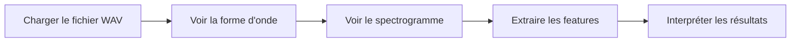

# Lab 01 - Signaux audio et features

## Objectif

Manipuler un extrait audio simple, visualiser sa forme d'onde et son spectrogramme, puis extraire quelques features de base.

## Schéma du lab



Ce schéma donne la logique générale du lab avant de lire les étapes une par une.

## Vocabulaire

- **Signal audio** : suite de valeurs qui représente le son dans le temps.
- **Librosa** : bibliothèque Python pour lire, visualiser et analyser un signal audio.
- **Feature** : mesure numérique compacte extraite du signal.
- **Forme d'onde** : lecture temporelle de l'amplitude.
- **Spectrogramme** : lecture temps-fréquence de l'énergie.
- **ZCR** : nombre de changements de signe du signal.
- **Zero crossing rate** : même chose que ZCR, utile pour mesurer le caractère plus ou moins agité d'un son.
- **Centroid spectral** : fréquence moyenne pondérée par l'énergie.
- **Centre spectral** : même chose que centroid spectral, il indique où l'énergie est concentrée.
- **Bandwidth spectrale** : largeur de dispersion autour du centroid.
- **STFT** : méthode pour observer l'évolution des fréquences dans le temps.

## Fichier audio

L'extrait de référence est dans `assets/exemple_cours.wav`.

## Etape 1 - Charger le signal

**Résultat attendu**
Lire le fichier audio et vérifier sa fréquence d'échantillonnage.

**Lien avec la théorie**
On passe de la notion abstraite de signal à une représentation numérique concrète.

```python
# Lecture du fichier audio de reference.
from scipy.io import wavfile

sr, y = wavfile.read("assets/exemple_cours.wav")
print("sr =", sr)
print("shape =", y.shape)
```

**Explication du code**
On charge le fichier audio et on verifie sa forme interne. C'est la première etape avant toute analyse du signal.

**Interprétation du résultat**
- `sr` doit afficher la fréquence d'échantillonnage.
- `shape` indique combien d'échantillons contient le fichier.
- Plus `shape` est grand, plus le fichier contient de données audio.

**Ce que cela signifie**
On vérifie d'abord que le fichier est bien lu, puis on contrôle sa taille pour savoir si on travaille sur un extrait court ou long.

## Etape 2 - Visualiser la forme d'onde

**Résultat attendu**
Observer la variation d'amplitude dans le temps.

**Lien avec la théorie**
La forme d'onde illustre directement l'énergie du signal au cours du temps.

```python
# Outil de tracé.
import matplotlib.pyplot as plt
# Lecture du fichier audio.
from scipy.io import wavfile

# Chargement du signal.
sr, y = wavfile.read("assets/exemple_cours.wav")
# Normalisation pour un affichage lisible.
y = y.astype(float) / 32768.0
# Axe temporel en secondes.
t = [i / sr for i in range(len(y))]

# Trace de la forme d'onde.
plt.plot(t, y)
plt.title("Forme d'onde")
plt.xlabel("Temps (s)")
plt.ylabel("Amplitude")
plt.show()
```

**Explication du code**
Cette étape visualise l'amplitude du signal dans le temps. Elle permet de voir la structure globale du morceau avant de passer au domaine fréquentiel.

**Interprétation du résultat**
- La courbe montre où le son est fort ou faible.
- Des pics très marqués peuvent signaler des attaques ou des changements brusques.
- Une courbe plus régulière traduit souvent un son plus stable.

**Ce que cela signifie**
La forme d'onde est une vue simple du signal. Elle ne dit pas encore quelles fréquences sont présentes, mais elle aide à repérer les variations globales.

## Etape 3 - Visualiser le spectrogramme

**Résultat attendu**
Voir comment l'énergie se répartit selon le temps et les fréquences.

**Lien avec la théorie**
Le spectrogramme relie la partie temporelle à la partie fréquentielle du signal.

```python
# Calcul numérique.
import numpy as np
# Outil de tracé.
import matplotlib.pyplot as plt
# Calcul du spectrogramme.
from scipy import signal
# Lecture du fichier audio.
from scipy.io import wavfile

# Chargement et normalisation du signal.
sr, y = wavfile.read("assets/exemple_cours.wav")
y = y.astype(float) / 32768.0
# STFT pour observer le signal par fenêtres.
f, tt, Zxx = signal.stft(y, fs=sr, nperseg=1024)

# Affichage du spectrogramme.
plt.pcolormesh(tt, f, np.abs(Zxx), shading="gouraud")
plt.title("Spectrogramme")
plt.xlabel("Temps (s)")
plt.ylabel("Fréquence (Hz)")
plt.colorbar(label="Amplitude")
plt.show()
```

**Explication du code**
Le spectrogramme montre comment l'énergie se répartit entre le temps et les fréquences. C'est utile pour repérer les changements de timbre, d'intensité ou de contenu harmonique.

**Interprétation du résultat**
- Les zones claires montrent là où l'énergie est forte.
- L'axe vertical correspond aux fréquences.
- L'axe horizontal correspond au temps.
- C'est une vue très utile pour comparer plusieurs morceaux.

**Ce que cela signifie**
Le spectrogramme permet de voir comment le son évolue dans le temps et quelles fréquences dominent à chaque instant.

## Etape 4 - Extraire des features

**Résultat attendu**
Calculer quelques descripteurs simples pour caractériser le son.

**Lien avec la théorie**
Ces features condensent l'information utile pour comparer deux sons ou préparer un modèle.

**Pourquoi ces features ?**
Le but est de transformer le son brut en variables exploitables pour comparer, classer ou recommander.

**Comprendre ZCR et centre spectral**
- Le **ZCR** augmente souvent quand le signal est plus bruité, plus percussif ou plus riche en variations rapides.
- Le **centre spectral** monte quand l'énergie se déplace vers les hautes fréquences et baisse quand le son est plus grave ou plus sombre.

**Ce qu'il faut comprendre avant de coder**
- Le signal brut est trop long et trop riche pour être utilisé tel quel directement dans un modèle simple.
- Une feature est un résumé du signal qui garde une information utile.
- Plus les features sont pertinentes, plus le modèle aura de chances d'être efficace.

```python
# Calcul numérique.
import numpy as np
# Lecture du fichier audio.
from scipy.io import wavfile

# Chargement et normalisation du signal.
sr, y = wavfile.read("assets/exemple_cours.wav")
y = y.astype(float) / 32768.0

# Zero crossing rate : nombre de changements de signe.
zcr = np.mean(np.abs(np.diff(np.sign(y))) > 0)
# Axe fréquentiel.
freqs = np.fft.rfftfreq(len(y), d=1 / sr)
# Spectre en amplitude.
spec = np.abs(np.fft.rfft(y))
spec_sum = spec.sum()
# Centre spectral.
centroid = (freqs * spec).sum() / spec_sum

# Largeur spectrale autour du centre.
bandwidth = np.sqrt(((freqs - centroid) ** 2 * spec).sum() / spec_sum)

print("ZCR =", zcr)
print("Centroid =", centroid)
print("Bandwidth =", bandwidth)
```

**Explication du code**
Ce bloc extrait des features simples à partir du signal. Elles compressent l'information audio dans quelques variables utiles pour comparer des morceaux ou alimenter un modèle.

**Interprétation du résultat**
- `ZCR` donne une idée de l'agitation du signal.
- `Centroid` indique si l'énergie est plutôt grave ou aiguë.
- `Bandwidth` indique si l'énergie est concentrée ou étalée.
- Ces valeurs servent ensuite à comparer deux sons ou à nourrir un modèle.

**Ce que cela signifie**
Les features transforment un son brut en quelques nombres faciles à comparer. C'est ce qui permet de passer du signal à l'apprentissage automatique.

## Conclusion

Le lab montre comment partir d'un fichier audio simple pour aller vers des représentations exploitables en traitement audio.
